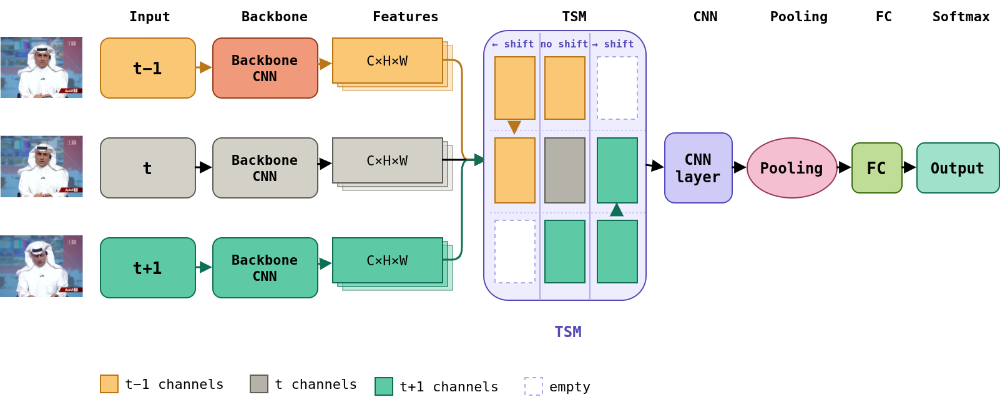
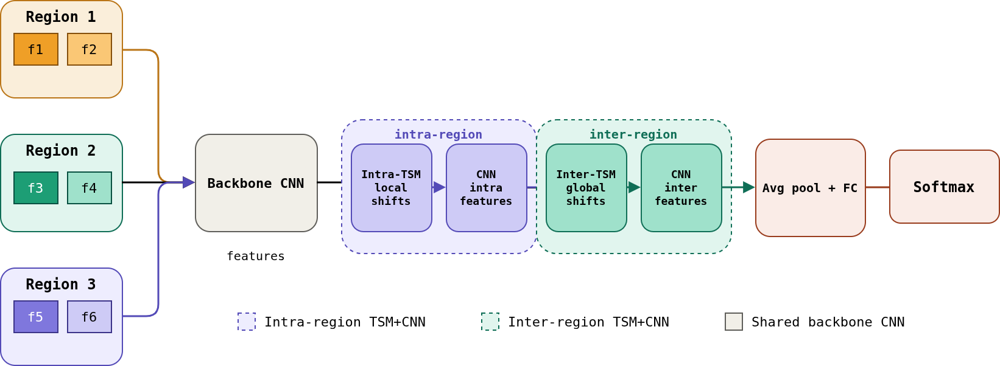

# Efficient Deepfake Detection on Edge Devices

This repository implements a lightweight and real-time deepfake detection framework designed for resource-constrained environments such as mobile and edge devices.

## Overview

Modern deepfake detectors are computationally expensive and unsuitable for deployment on low-power hardware. This project addresses that limitation by combining efficient spatial feature extraction with lightweight temporal modeling.

We use:

- **MobileNet** as the backbone for efficient feature extraction
- **Temporal Shift Module (TSM)** for temporal reasoning with minimal overhead
- **Hierarchical TSM (HTSM)** for multi-scale temporal aggregation

## Architecture

### Temporal Shift Module (TSM)

  

TSM enables temporal interaction between frames with zero additional parameters and negligible computation cost.

### Hierarchical TSM (HTSM)

  

HTSM extends TSM by capturing both intra-region (local) and inter-region (global) temporal dependencies.
